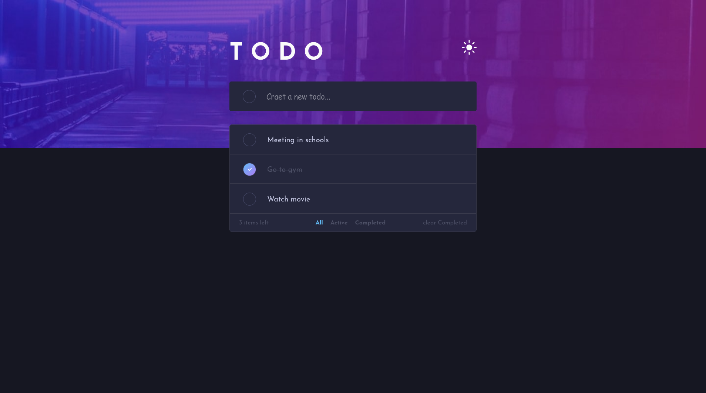
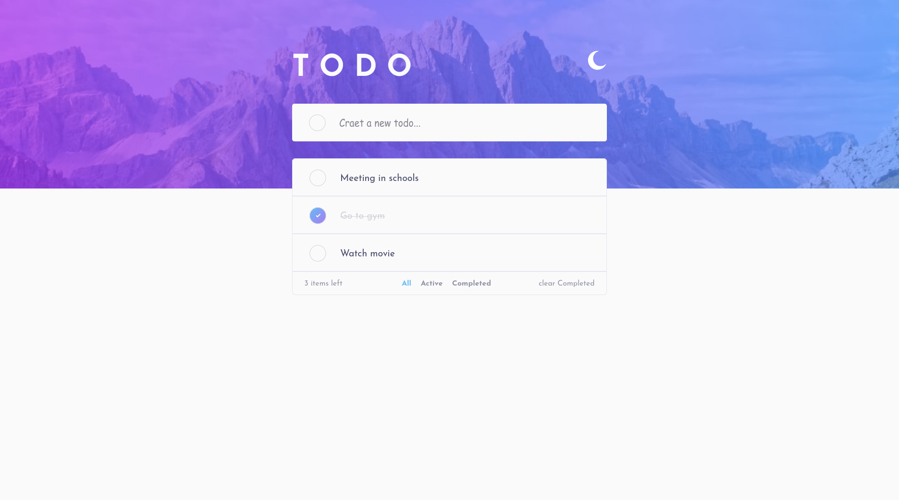

# Todo-List Application

This is a solution to [Todo app challenge on Frontend Mentor](https://www.frontendmentor.io/challenges/todo-app-Su1_KokOW). Frontend Mentor challenges help you improve your coding skills by building realistic projects.

## Overview

### The challenge

Your users should be able to:

- [x] View the optimal layout for the app depending on their device's screen size
- [x] See hover states for all interactive elements on the page
- [x] Add new todos to the list
- [x] Mark todos as complete
- [x] Delete todos from the list
- [x] Filter by all/active/complete todos
- [x] Clear all completed todos
- [x] Toggle light and dark mode
- [ ] **Bonus**: Drag and drop to reorder items on the list

### Screenshot

### Links

- Solution URL: [FrontendMentor](https://www.frontendmentor.io/solutions/todo-app-qiu-jIRWI)
- Live Site URL: [Live-site](https://talalbnoob-todo-list.netlify.app/)

## My process

### Built with

- [Sass/Scss](https://sass-lang.com/)
- Flexbox
- [React](https://reactjs.org/) - JS library

### What I learned

I try to use react so I learned a lot about how to make a website using react and a javascript library and I learned about working with flexbox

## Author

- Frontend Mentor - [TalalBnoob](hhttps://www.frontendmentor.io/profile/TalalBnoob)
- Email - TalalBnoob@gmail.com
